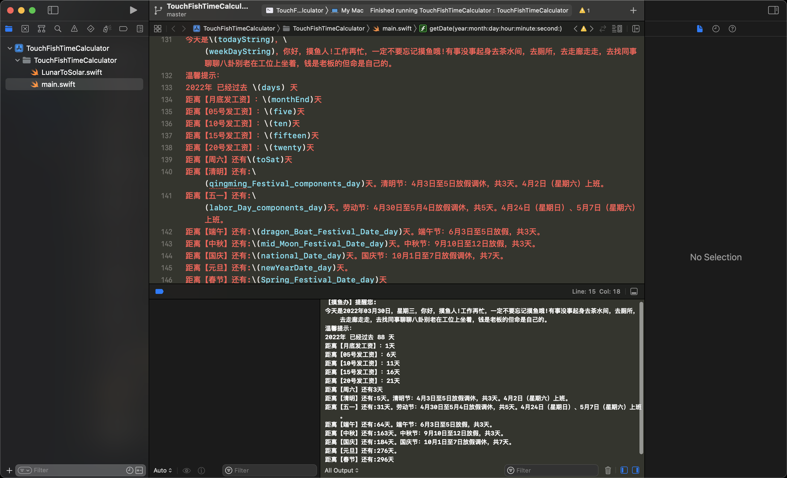

# TouchFishTimeCalculator
TouchFishTimeCalculator

 【摸鱼办】提醒您:

 今天是2022年03月30日，星期三，你好，摸鱼人!工作再忙，一定不要忘记摸鱼哦!有事没事起身去茶水间，去厕所，去走廊走走，去找同事聊聊八卦别老在工位上坐着，钱是老板的但命是自己的。

 温馨提示：
 2022年 已经过去 88 天

 距离【月底发工资】：1天

 距离【05号发工资】：6天

 距离【10号发工资】：11天

 距离【15号发工资】：16天

 距离【20号发工资】：21天

 距离【周六】还有3天

 距离【清明】还有:5天。清明节：4月3日至5日放假调休，共3天。4月2日（星期六）上班。

 距离【五一】还有:31天。劳动节：4月30日至5月4日放假调休，共5天。4月24日（星期日）、5月7日（星期六）上班。

 距离【端午】还有:64天。端午节：6月3日至5日放假，共3天。

 距离【中秋】还有:163天。中秋节：9月10日至12日放假，共3天。

 距离【国庆】还有:184天。国庆节：10月1日至7日放假调休，共7天。

 距离【元旦】还有:276天。

 距离【春节】还有:296天

